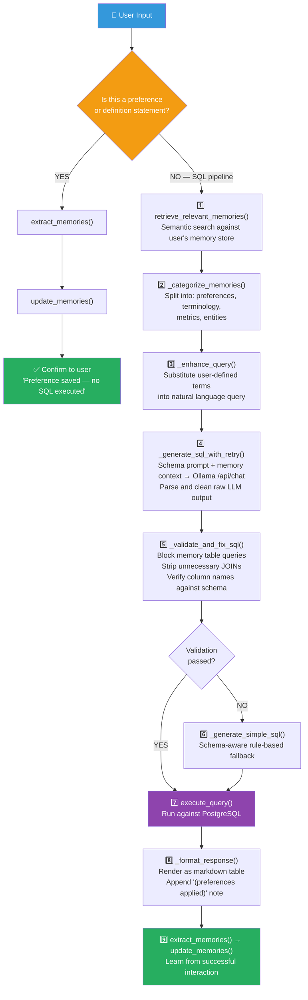
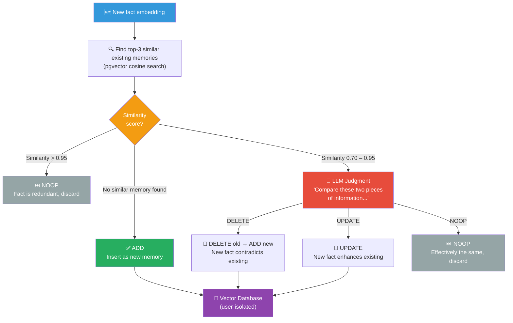

# Building a Fully Local, Open-Source Text2SQL Agent With Long-Term Memory — No API Keys, No Cloud, No Vendor Lock-In

*A production-grade text-to-SQL system with persistent memory that runs entirely on your own hardware using Ollama, PostgreSQL, pgvector, and sentence-transformers*

---

[IMAGE — GENERATE WITH AI:
Prompt: "A clean, minimal, wide-format hero illustration for a technical blog post. Dark navy-blue background. In the center, a glowing translucent brain made of circuit-board traces and soft neon blue light, symbolizing AI memory. On the left side, a silhouette of a sales operations manager with a small floating speech bubble showing 'only Indian customers'. On the right side, a silhouette of an e-commerce analyst with a floating speech bubble showing 'high value orders > ₹10K'. From each person, faint glowing lines flow into the central brain. Below the brain, two separate SQL code snippets glow faintly — left side shows 'WHERE country = India', right side shows 'WHERE total_amount > 10000'. The overall mood is futuristic, clean, and professional. Plenty of negative space. No clutter. Suitable as a blog header image at 1200x600px aspect ratio. Flat illustration style, not photorealistic."
]

Every text2SQL tutorial I've seen relies on OpenAI for the LLM, Pinecone for vectors, and some managed cloud service to glue it all together. That's fine for a demo — but the moment you're dealing with real business data, sending your database schema and user queries to a third-party API isn't just expensive, it's a non-starter for a lot of teams.

So I built the whole thing local. **Fully open-source. Zero API keys. Zero cloud dependencies.** The LLM runs on your machine via Ollama. The vectors live in PostgreSQL with pgvector. Embeddings come from sentence-transformers. The frontend is Gradio. Everything stays on your hardware, and you own every piece of it.

On top of that local-first foundation, I added something most text2SQL systems completely ignore: **long-term memory**. The system remembers your preferences, your terminology, your metrics — across sessions, per user, with complete memory isolation. It's inspired by the Mem0 architecture research paper, but I built every line from scratch. No official Mem0 libraries. Just the core principles, adapted specifically for text2SQL.

In this tutorial, I'll walk you through the entire implementation — every component, every design decision, every prompt. Let's get into it.

---

## Why This Needs to Exist

Here's the thing about traditional text2SQL systems — every conversation starts from scratch. Preferences, terminology, context: all gone the moment a session ends. Your AI assistant has the memory of a goldfish.

And here's the other thing — most of them also require an OpenAI API key and a cloud vector database. So not only does your assistant forget everything, it's also sending your proprietary schema and business queries to someone else's servers. You're paying per token for the privilege of zero privacy.

Think about it concretely. A sales operations manager opens her dashboard every morning and has to type "only show me customers from India" before doing anything useful. An e-commerce analyst has to re-explain that "high value order" means orders with a total amount over 10,000. Every. Single. Time. And all of that context is flowing through third-party APIs.

That's what I call the **cognitive load problem** — the AI assistant should be learning from you, but it isn't.

Long-term memory changes this completely. With it, your text2SQL agent can:

- **Remember preferences across sessions** — automatically filtering by user-specific criteria like "only show customers from India" or "only delivered orders" without being told again
- **Learn domain terminology** that bridges the gap between how users talk and what the database schema actually looks like — something like "high value order" mapping to `total_amount > 10000` or "big spenders" mapping to customers whose total order value exceeds 50,000
- **Maintain context over time** — so you can ask "How many of those were wholesale?" days later, and the system knows what "those" refers to
- **Build personalized understanding** of each user's data interests, improving relevance without explicit instruction

This isn't just a nice-to-have. It fundamentally changes how people interact with data.

---

## What is Mem0, and How It Inspired This Architecture

Mem0 (pronounced "mem-zero") is a memory architecture from mem0.ai that tackles the limited context window problem through a two-phase system: extracting key information from conversations, and then updating memory to maintain consistency over time.

I took this core idea and extended it with **multi-user memory isolation** — something critical for any production deployment. Here's what that means:

1. **Complete memory isolation**: Each user's preferences are stored separately. Priya's "only Indian customers" preference never leaks into Rahul's queries.
2. **User-targeted extraction**: The system identifies SQL-relevant elements — entities, preferences, terminology, metrics — per user.
3. **Database integration**: Personalized memories connect directly to the database schema for accurate SQL generation.

The result is that a sales operations manager automatically gets her regional customer filter, an e-commerce analyst uses his specialized order terminology, and a team lead references custom metrics — all without restating anything each session.

[DIAGRAM: A horizontal three-phase architecture diagram flowing left to right, with a large "Vector Database (PostgreSQL + pgvector)" cylinder centered at the top connecting down to all three phases.

**Phase 1 — Extraction (blue background box, left side):**
- Top: "New Message Pair" box (User Question + AI Response) with an arrow down
- Two context sources feeding in from the sides: "Conversation Summary" (left) and "Recent m Messages" (right)
- Arrow down to: "LLM Processing" box labeled "Analyze conversation context"
- Arrow down to output: "Extracted Information"

**Phase 2 — Text2SQL Memory Extraction (red/coral background box, center):**
- Input: "Extracted Information" arrow from Phase 1
- Four output branches, each as a labeled rounded rectangle:
  - "[PREFERENCE] Filtering & sorting preferences" (e.g., "only customers from India")
  - "[TERM] Terminology mappings" (e.g., "high value order = total_amount > 10000")
  - "[METRIC] Custom calculations & KPIs" (e.g., "average order value = SUM(total_amount) / COUNT(*)")
  - "[ENTITY] Frequently accessed tables & columns"
- All four branches have arrows pointing up toward the Vector Database cylinder

**Phase 3 — Update (green background box, right side):**
- Input: arrows from the four memory types
- "Similarity Search" box — finds top-3 similar existing memories
- Decision diamond with three outgoing paths:
  - "No match found" → "ADD (new memory)"
  - "Similarity > 0.95" → "NOOP (redundant, discard)"
  - "Similarity 0.70–0.95" → "LLM Classifies" → three sub-paths: "UPDATE (enhance)", "DELETE (contradict & replace)", "NOOP (same meaning)"
- All ADD/UPDATE/DELETE paths have arrows back up to the Vector Database cylinder

**Visual style:** Clean, modern, flat design. Each phase in its own colored container. Arrows are solid with small directional chevrons. The Vector Database cylinder at top spans the full width, visually connecting all three phases. Small lock icons on the Vector Database labeled "user_id isolation" to indicate per-user memory separation.]

---

## The Tech stack I used -
I wanted to keep this as local as possible hence everything runs on my Acer Predator Helios with a 6 GB VRAM constraint that ruled bigger 70–80B models and massive embedding models, and forced every choice to fit in 6 gigs while staying fast enough for interactive use.
LLM (SQL + memory): qwen2.5-coder:7b via Ollama.
Text embeddings: sentence-transformers/all-MiniLM-L6-v2 via Hugginface.
Vector database: PostgreSQL + pgvector
Business data store: PostgreSQL
Web interface: Gradio

No cloud, no API keys, no recurring costs, completely local in your hardware - and the output quality is quite decent for what fits on consumer hardware.

---

## The Four Core Modules

Now that you've seen how the memory system *thinks*, let's look at how the codebase is organized. Four files do the heavy lifting:

| Component | File | What It Does |
|-----------|------|-------------|
| **Memory Agent** | `memory_agent_opensource.py` | Mem0-inspired extraction, storage, retrieval. Vector similarity search with user isolation. |
| **Text2SQL Chatbot** | `text2sql_chatbot.py` | Query classification, schema-grounded SQL generation, validation, JOIN stripping, fallback. |
| **PostgreSQL Client** | `postgreSQL_data_client.py` | Schema introspection, foreign key discovery, query execution, metadata caching. |
| **Gradio Frontend** | `gradio_frontend.py` | Web UI with chat, memory bank display, SQL syntax highlighting. |

Now let's go through each one.

---

## The SQL Generation Pipeline

Every user message flows through a strict, ordered pipeline. This is the heart of the system, and understanding it will make everything else click.

[FLOWCHART — Use this Mermaid code as structural reference, then create a polished diagram:]



Here's the flow:

1. **Is this a preference statement?** — A regex-based classifier checks first. If the user says "Always show me customers from India," that's a preference, not a query. It gets routed to the memory system, not the SQL pipeline.
2. **Retrieve relevant memories** — Semantic search against the user's memory store pulls up anything relevant to the current question.
3. **Categorize memories** — Retrieved memories are split into preferences, terminology, metrics, and entities. Each type is applied differently.
4. **Enhance the query** — User-defined terms get substituted into the natural language query before it hits the LLM.
5. **Generate SQL (with retry)** — The enhanced query plus schema plus memory context goes to Ollama's `/api/chat` endpoint.
6. **Validate and fix** — The generated SQL is checked against the real schema. Unnecessary JOINs are stripped. Column names are verified.
7. **Fallback** — If steps 5-6 fail, a schema-aware rule-based generator produces valid SQL.
8. **Execute** — The validated query runs against PostgreSQL.
9. **Learn** — Successful interactions feed back into the memory extraction pipeline.

That secondary gate in step 1 is important — if a message contains question words like "what," "show me," "list," or "count," it gets routed to the SQL pipeline even if a preference pattern matches. This prevents false positives.

---

## How the Mem0 Memory System Works

This is the part I'm most excited about. Let me walk through the two-phase architecture.

### Phase 1 — Memory Extraction

When a user sends a message, the LLM analyzes **only the user's message** to extract structured facts. The AI response is intentionally excluded — it's often a table of SQL results, and column names would get extracted as fake memories. I learned this the hard way.

The extraction prompt instructs the model to tag facts into four categories:

**[CODE — Memory extraction prompt]**
*What it does:* Instructs the LLM to scan a single user message and tag any preferences, term definitions, or custom metrics it finds, returning `NONE` when there's nothing worth saving. This is the prompt that actually populates long-term memory.
*Where to find it:* [`core_logic/memory_agent_opensource.py`](core_logic/memory_agent_opensource.py#L745-L761) — inside the `extract_memories()` method on the `MemoryAgent` class. Copy the multi-line `prompt = (...)` string literal — start at `"You extract user preferences..."` and end with `"Facts (or NONE):"` (the closing parenthesis of the tuple is the boundary).

Output is parsed line by line — only lines containing a valid tag (`[PREFERENCE]`, `[TERM]`, `[METRIC]`, `[ENTITY]`) with meaningful content (more than 5 characters after the tag) are accepted. I also cap it at a maximum of 2 facts per extraction call to prevent the model from over-extracting on long messages.

If there's nothing meaningful to extract, the model outputs exactly `NONE` — a hard gate that prevents noise from accumulating in the memory store.

### Phase 2 — Memory Update (ADD / UPDATE / DELETE / NOOP)

Each extracted fact gets compared against the user's existing memories using cosine similarity. The system then classifies the operation:

[FLOWCHART — Use this Mermaid code as structural reference, then create a polished diagram:]



When similarity falls in that 0.70–0.95 range, the LLM is asked to classify the relationship. The prompt is intentionally minimal — we don't want the model overthinking:

**[CODE — Memory operation classification prompt]**
*What it does:* When a new fact has 0.70–0.95 cosine similarity to an existing memory, this short prompt asks the LLM to decide between `DELETE` (the new fact contradicts the old), `UPDATE` (the new fact enriches the old), or `NOOP` (they mean the same thing). The response is `.strip().upper()`-validated against those three values; anything else falls back to `NOOP`.
*Where to find it:* [`core_logic/memory_agent_opensource.py`](core_logic/memory_agent_opensource.py#L879-L888) — inside `_determine_operation()` on the `MemoryAgent` class. Copy the f-string starting with `"""Compare these two pieces of information:` and ending with `Decision:"""`.

The response is `.strip().upper()` and validated against the three allowed values. Anything else defaults to `NOOP` — conservative by design.

This layered approach means the memory store stays accurate over time. Contradictions get resolved, redundancies get filtered, and new information integrates correctly.

### Memory Retrieval at Query Time

When a user asks a question, the query is embedded and compared against their entire memory store using pgvector's cosine similarity search — scoped to that user's `user_id`. Only the top-k most semantically relevant memories surface. Here's the actual query the system runs, lifted straight from [`memory_agent_opensource.py`](core_logic/memory_agent_opensource.py#L247-L254) inside `PostgresMemoryStore.find_similar_memories()`:

```python
cursor.execute("""
SELECT id, content, created_at, source, metadata, embedding,
       (1 - (embedding <=> %s::vector)) AS similarity
FROM memories
WHERE user_id = %s AND embedding IS NOT NULL
ORDER BY embedding <=> %s::vector
LIMIT %s;
""", (embedding_str, user_id, embedding_str, top_k))
```

Two things in this query are worth a quick explanation:

**The `%s` placeholders** are just safe value slots. At runtime, psycopg2 fills them in from the tuple on the right — `embedding_str` goes into the first and third `%s`, `user_id` into the second, `top_k` into the fourth. We use `%s` instead of pasting the values directly into the string because the driver handles escaping for us — a malicious input like `'; DROP TABLE memories;--` gets treated as a literal string, not as SQL.

**The `(1 - (embedding <=> %s::vector)) AS similarity` formula** turns a *distance* into a *similarity score*. The `<=>` operator is pgvector's **cosine distance** — it returns `0` when two vectors point in the exact same direction (identical meaning) and grows larger as they drift apart. That's backwards from how people naturally think about matches — we want "1 = perfect match, 0 = unrelated." So we just subtract the distance from 1 to flip it: `1 - distance = similarity`. The `::vector` part tells PostgreSQL to read the input string as a pgvector vector so the `<=>` operator knows what to do with it.

That's the gist. Only memories actually relevant to the current question show up — not the entire history — and it stays fast even as a user's memory store grows into the hundreds.

### Memory Categories in Practice

Here's a concrete example of how it all comes together:

A user says "Always show me customers from India." The system stores this as `[PREFERENCE] country = 'India'`.

Later, the user says "High value order means total amount over 10000." Stored as `[TERM] high value order = total_amount > 10000`.

Now when the user asks "Show me customers who have a high order value," both memories get retrieved via semantic search. The SQL is generated with the India filter and the terminology definition pre-applied — the generated query includes `WHERE c.country = 'India' AND o.total_amount > 10000`. The response includes a note: "(Note: preferences applied)" — transparency matters.

---

## Implementing Multi-User Memory Storage

The heart of the memory system is PostgreSQL with the pgvector extension. We maintain three tables, and every single row is scoped to a `user_id`:

**[CODE — Schema setup: three tables + HNSW index + user_id indexes]**
*What it does:* Bootstraps the memory storage layer on first run. It enables the `vector` extension, then creates the `memories`, `conversation_summaries`, and `recent_messages` tables (each scoped by `user_id`), an HNSW index on the 384-dim embedding column for fast similarity search, and B-tree indexes on every `user_id` column so per-user filtering never triggers a full scan.
*Where to find it:* [`core_logic/memory_agent_opensource.py`](core_logic/memory_agent_opensource.py#L60-L122) — inside the `_init_db()` method on `PostgresMemoryStore`. Copy the block of `cursor.execute(...)` calls from the `CREATE EXTENSION IF NOT EXISTS vector;` line down through the `messages_user_id_idx` creation. You can omit the surrounding `try`/`except` boilerplate.

The `memories` table stores the actual content with 384-dimensional embeddings from all-MiniLM-L6-v2. The HNSW index gives us fast approximate nearest-neighbor search — crucial for real-time performance. The `user_id` index ensures per-user operations never trigger full table scans.

For development or testing, the system also supports a JSON file storage fallback. It's slower (cosine similarity has to be calculated manually in Python), but it works without any database setup. You just leave the `MEMORY_DB_CONNECTION` environment variable empty.

**[CODE — JSON fallback: manual cosine similarity in Python]**
*What it does:* When PostgreSQL isn't available, the system loads all of a user's memories from a JSON file and computes cosine similarity in pure Python using NumPy (`np.dot(a, b) / (norm(a) * norm(b))`). It then sorts descending and returns the top-k. Slower than pgvector — `O(n)` per query — but zero infrastructure to set up.
*Where to find it:* [`core_logic/memory_agent_opensource.py`](core_logic/memory_agent_opensource.py#L472-L505) — the `find_similar_memories()` method on the `JSONMemoryStore` class. Copy the entire method definition, from `def find_similar_memories(self, embedding: List[float], user_id: str, top_k: int = 5)` through `return similarities[:top_k]`.

---

## The PostgreSQL Data Client

The data client handles schema introspection — it's how the system knows what tables, columns, and relationships exist in your database. This is critical because all SQL generation is grounded against the real schema, never hardcoded.

**[CODE — `PostgresDataClient`: connection + schema introspection]**
*What it does:* `__init__` stores the connection string and runs a smoke test by opening and immediately closing a connection (so configuration errors fail loudly at startup, not on the first query). `get_schema_metadata()` then does the heavy lifting — it walks `information_schema` and `pg_catalog` to discover every table, every column with its data type and nullability, primary keys, foreign keys (which it also rolls up into a top-level `relationships` list), and non-PK indexes. The result is the structured dict that the SQL generator grounds every prompt against.
*Where to find it:* [`core_logic/postgreSQL_data_client.py`](core_logic/postgreSQL_data_client.py#L19-L226) — the `PostgresDataClient` class. Copy three things in order: the `__init__` method (lines 19–26), the small `_test_connection()` helper it calls (lines 28–36), and the full `get_schema_metadata()` method (lines 38–226, ending at the `finally: if conn: conn.close()` block). The method is named `get_schema_metadata`, not `get_metadata` — the blog title was shorthand.

The client discovers foreign keys, caches metadata, and handles query execution. The modular design means you could swap this out for a Snowflake client, a Databricks client, or anything else without touching the memory architecture.

---

## Prompt Engineering for 7B Models

This is where things get interesting. Because we're targeting 7B-parameter local models (not GPT-4), prompts need to be compact, unambiguous, and structured to reliably produce parseable output. Every prompt in the system was designed with this constraint in mind.

### SQL Generation Prompt

We use Ollama's `/api/chat` endpoint with a split system + user message structure. I actually started with `/api/generate` using a SQL completion trick, but instruction-tuned models like qwen2.5-coder behave fundamentally differently in completion mode versus chat mode. The chat format was essential for reliable output.

**System message** — sets the model's strict output contract:

**[CODE — SQL generation system message]**
*What it does:* A four-line system prompt that hammers home a single rule: produce raw SQL, nothing else. No markdown fences, no commentary, no backticks. Keeping the contract this strict is what makes the downstream `_clean_sql_response()` parser reliable on a 7B model.
*Where to find it:* [`core_logic/text2sql_chatbot.py`](core_logic/text2sql_chatbot.py#L425-L430) — inside `_generate_sql()` on the `Text2SQLChatbot` class. Copy just the `system_msg = (...)` string assignment.

**User message** — injects schema + memory context + question:

**[CODE — SQL generation user message template]**
*What it does:* Stitches together the four ingredients the model needs at query time: the compact one-line-per-table schema block, a short rules list (raw SQL only, avoid unnecessary JOINs, add `LIMIT 20` for non-aggregates), the optional memory context block (preferences and terminology), and finally the user's natural-language question. Memory context is conditionally injected only when there's something relevant to add.
*Where to find it:* [`core_logic/text2sql_chatbot.py`](core_logic/text2sql_chatbot.py#L432-L441) — inside `_generate_sql()`, immediately after `system_msg`. Copy the `user_msg = (...)` assignment. For full context you may also want to include the small `context_parts` block just above (lines 416–423) that builds the `memory_block` variable interpolated into the template.

### Why the Schema Block is Compact

Full schema blocks with data types, nullability, descriptions, and indexes can easily exceed 2,000 tokens for a moderate schema. At 4,096 token context windows, that leaves very little room for the question, memories, and SQL output. So the schema block is deliberately compressed to **one line per table** — table name and all column names — with value hints only for status/enum columns that the model needs for correct WHERE clauses.

### Decoding Parameters

SQL generation uses near-zero temperature to minimize hallucination:

**[CODE — Ollama decoding parameters for SQL generation]**
*What it does:* Sets the sampling knobs on the `/api/chat` request to make output as deterministic as possible: `temperature: 0.0` (no randomness), `top_k: 1` (always pick the single most likely next token), `top_p: 0.1` (nucleus sampling kept tight as a safety net), `num_predict: 400` (cap output length), `num_ctx: 4096` (match the model's context window), and `repeat_penalty: 1.0` (don't penalise — SQL legitimately repeats keywords like `AND`).
*Where to find it:* [`core_logic/text2sql_chatbot.py`](core_logic/text2sql_chatbot.py#L455-L462) — inside the `requests.post()` call within `_generate_sql()`. Copy the `"options": {...}` dict from the JSON payload.

You can experiment with these. I found that `temperature: 0.0` with `top_k: 1` gives the most deterministic output for SQL. Memory extraction uses a slightly higher temperature (0.1) because that task benefits from minor paraphrase variation when generalizing facts.

---

## The Preference Detection System

Before any message reaches the LLM, a regex-based preference detector classifies it. This avoids wasting LLM calls on messages that are clearly data queries, and correctly routes preference statements before they hit the SQL pipeline:

`[CODE: Paste the preference_patterns list and the secondary gate logic with question words]`

Patterns cover things like "I am only interested in...", "always show...", "never show...", "define X as...", and "X means Y". The secondary gate checks for question words — if a message says "Show me what I'm interested in," it goes to SQL, not the preference handler.

---

## The Gradio Web Interface

The frontend is built with Gradio Blocks, using a dark theme. It gives you a chat panel on the left and a Memory Bank on the right that updates in real time as the system learns your preferences. The database underneath is an e-commerce schema with two tables — `customers` (name, email, city, country, segment) and `orders` (status, order_date, total_amount, payment_method) — linked by `customer_id`.

📸 **INSERT SCREENSHOT: `Screenshot_20260412_204811.png`** — The login screen. Each username gets a completely isolated memory space — Priya's preferences never affect Rahul's queries. The optional database connection field lets you point at any PostgreSQL instance.

The workflow is straightforward:

1. **Login** — enter a username. Each username gets a completely isolated memory space.
2. **Load Schema** — the system introspects your PostgreSQL database and builds the table/column/FK map. In this demo, it discovers `customers` and `orders` with their foreign key relationship.
3. **Set Preferences** — teach the system what you care about. Say "Always show me customers from India" and it stores that as a preference.
4. **Define Terminology** — bridge the gap between how you talk and what the schema looks like. Say "High value order means total amount over 10000" and the system maps that to SQL conditions.
5. **Ask Questions** — natural language queries automatically have your preferences and terminology applied.

📸 **INSERT SCREENSHOT: `Screenshot_20260412_210517.png`** — Preference capture in action. The user says "Always show me customers from India" and the system confirms it, storing `country = 'India'` in the Memory Bank under PREFERENCES. The SQL panel shows "Preference stored — no SQL executed" — no query runs, the system just learns.

Preferences compound. The system doesn't just remember one thing — it builds a layered understanding of what you care about.

📸 **INSERT SCREENSHOT: `Screenshot_20260412_210838.png`** — A second preference layered on top. The user says "Recent means last 30 days" and the Memory Bank now shows two preferences: the India country filter and a date range filter. Each one will be applied automatically to future queries.

But preferences are just half the story. The system also learns your vocabulary — the domain-specific shorthand that bridges how you talk and what the database actually stores.

📸 **INSERT SCREENSHOT: `Screenshot_20260415_013913.png`** — Terminology definition. The user says "High value order means total amount over 10000" and the system stores it as a TERMINOLOGY memory. Now whenever the user mentions "high value" in a query, the system knows to translate that to `total_amount > 10000`.

Now watch what happens when preferences and terminology combine. The user asks a natural language question using their own vocabulary, and the system applies everything it has learned — the India filter, and the "high value" definition — to produce the right SQL.

📸 **INSERT SCREENSHOT: `Screenshot_20260415_023517.png`** — The payoff. The user asks "Show me customers who have a high order value." The system retrieves both the terminology memory (`high value order = total_amount > 10000`) and the preference memory (`country = 'India'`), generates a JOIN query across `customers` and `orders` with `WHERE c.country = 'India' AND o.total_amount > 10000`, and returns the matching results — all wholesale customers from Delhi and Chennai with large orders. The schema bar at the top confirms `testdb` with `customers, orders` tables loaded. Execution time: 0.030s.

Without memory, every single one of those queries would require the user to spell out "only Indian customers" and "where total amount is greater than 10000" — every time. With memory, they just say "show me customers with high order value" and everything clicks.

---

## Design Decisions and Trade-Offs

A few choices I made during development that are worth calling out.

### Why These Models?

All models run through Ollama's `/api/chat` endpoint, which means anything instruction-tuned works. But I tested a handful and here's what I found:

| Model | Speed | SQL Quality | Notes |
|-------|-------|-------------|-------|
| `gsxr/one:latest` | Fast | Excellent | **Recommended** — qwen2.5-coder:7b |
| `qwen2.5-coder:7b` | Fast | Excellent | Same model, official tag |
| `codellama:7b` | Fast | Good | Solid alternative |
| `qwen2.5:3b` | Very fast | Moderate | For low-memory machines |
| `qwen3:4b` | Fast | Good | Good balance |

The qwen2.5-coder:7b model hit the sweet spot for me — fast enough for interactive use, and its SQL output quality is genuinely impressive for a 7B model. CodeLlama is a solid fallback if you're already using it for other things.

### PostgreSQL for Everything

One decision I'm particularly happy with: using PostgreSQL for *both* the business data and the memory store. Most architectures use a separate vector database (Pinecone, Weaviate, Chroma), but pgvector gives you vector similarity search right inside Postgres. That means one database to manage, one connection pool, one backup strategy. For a project like this, the operational simplicity is worth it.

The trade-off is that pgvector's HNSW index is slightly slower than purpose-built vector databases at very large scale. But for per-user memory stores — where you're searching maybe a few hundred memories at most — it's more than fast enough.

### JSON Fallback for Development

During development, I didn't always want to spin up PostgreSQL just to test a prompt change. So the system supports a JSON file storage fallback — if you leave the memory database connection empty, it writes memories to local JSON files and calculates cosine similarity in Python. It's slower, but it works without any infrastructure.

### Lessons Learned

A few things I ran into that might save you time if you build something similar:

- **Exclude the AI response from memory extraction.** Early on, I was feeding both the user message and the AI response into the extraction prompt. The AI response is often a results table, and the LLM would extract column names as "facts." Scoping extraction to only the user's message fixed this completely.
- **Cap extractions per message.** Without a limit, the model sometimes over-extracts on long messages — pulling out 5-6 "facts" that are really just restatements of the same thing. Capping at 2 per call keeps the memory store clean.
- **The preference detector needs a secondary gate.** A regex like `r"i\s+am\s+interested\s+in"` will match "Show me what I am interested in" — which is a query, not a preference. Adding a check for question words (`what`, `show me`, `list`, `count`) prevents this.

---

## Future Work

The single most impactful planned feature is **user-selectable LLM models** — a model dropdown in the Gradio UI that lists all models available in your local Ollama instance, with the ability to switch mid-session. This would make it trivial to compare how different models perform on the same schema and queries.

Other things on my list:

- **Connection pooling** — replace per-operation `psycopg2.connect()` calls with `SimpleConnectionPool` for better throughput
- **Memory quality gating** — only store memories from queries that returned non-empty results, reducing noise
- **Cross-session memory summarization** — periodically compress old memories into higher-level summaries

---

## Conclusion

Long-term memory transforms text2SQL agents from basic query translators into collaborative partners that actually learn from you over time. By implementing this memory system inspired by the Mem0 architecture, I built a text2SQL agent that remembers what matters — preferences, terminology, metrics, entities — and applies that knowledge automatically.

The system extracts, stores, and retrieves important facts from conversations, allowing the agent to maintain context across sessions and provide increasingly personalized experiences. And because it's all local and open-source, your data never leaves your machine.

While I used PostgreSQL as the target database for this demonstration, the same architecture works equally well with Snowflake, Databricks, or any traditional database. The key innovation is the memory system itself, which stays consistent regardless of the underlying data platform.

Hope you liked it. If you have questions or want to build on this, I'd love to hear from you.

---

## Resources

- [LINK: Full source code on GitHub]
- [LINK: Mem0 research paper — mem0.ai/research]
- [LINK: pgvector extension — github.com/pgvector/pgvector]
- [LINK: Ollama — ollama.ai]
- [LINK: sentence-transformers documentation]
- [LINK: Gradio documentation — gradio.app]
- [LINK: qwen2.5-coder model page on Ollama]
